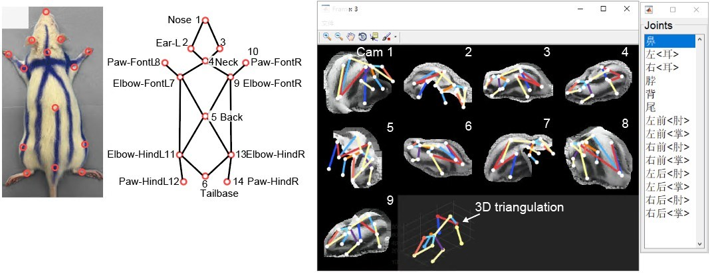
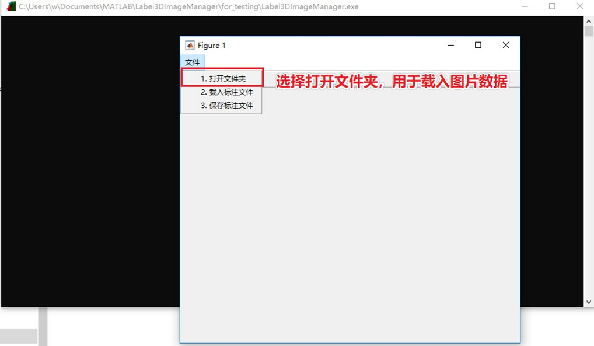
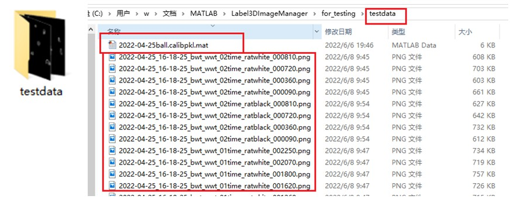
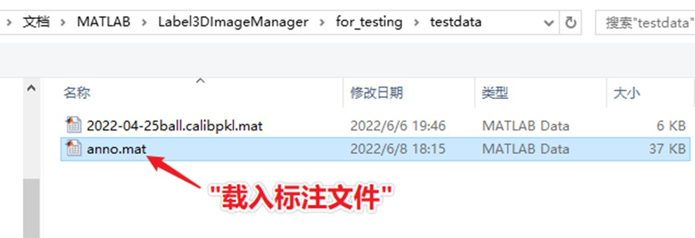
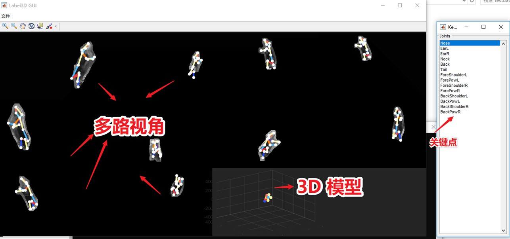
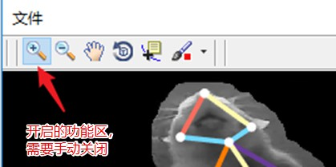
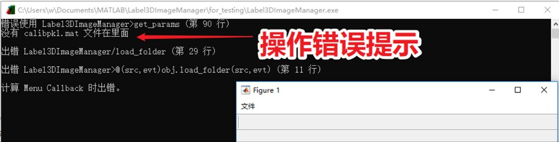

# Label3D

Label3D is a GUI for the manual labeling of 3D keypoints in multiple cameras. Forked from [diegoaldarondo/Label3D](https://github.com/diegoaldarondo/Label3D)





## Installation

To install Label3D,. use:

```cmd
git clone --depth=1 https://github.com/chenxinfeng4/Label3D.git Label3D
```

Open the Label3D folder, and run `setup.bat`. This will append the code path into matlab path manager.

Now, you will see the label3D GUI popping out.

```matlab
>> Label3DImageManager
```


## Features
1. Simultaneous viewing of any number of camera views
2. Multiview triangulation of 3D keypoints
3. Point-and-click and draggable gestures to label keypoints
4. Zooming, panning, and other default Matlab gestures

## Improvement from original code (diegoaldarondo)

- The camera calibration file is specified in `ball_xx.calibpkl.mat` in this project.
- The label source is image file in this project, is video file in the orginal project.
- The original project requires large depends downloading.
- The keypoint order is customized in this project.


## 使用方法

Requires `Matlab 2019b`, `Matlab 2020a`, or `Matlab 2020b`

1. 进入Matlab，打开 Label3DImageManager. 

```
>> Label3DImageManager
```



2. “打开文件夹”，例如 “testdata/”, 包含图片和 mat 文件。等待半分钟数据载入。**载入新文件夹，请重启软件，以防错误。**




3. “载入和保存标注文件”，文件名为 “anno.mat”





4. 常用快捷键

| 快捷键  | 功能                                               |
| ------- | -------------------------------------------------- |
| `t`     | 2D -> 3D。（需要至少2个视角的2D点，推荐3-5个视角） |
| `TAB`   | 下一个关键点                                       |
| `f`     | 等于 `t` 加 `→`                                    |
| `x`     | 删除当前一个3D关键点                               |
| `u`     | 删除当前所有3D关键点                               |
| `p`     | 是否显示 3D 模型图（默认开启）                     |
| `z`     | 放大（Zoom）                                       |
| `←` `→` | 前一张，后一张图片                                 |

如果“快捷键”没有反应，可能是1 . “开启了功能区”没有关闭。2. 要切换到“英文输入法”



5. 操作错误提示，可见黑框中




代码参考自 https://github.com/diegoaldarondo/Label3D

